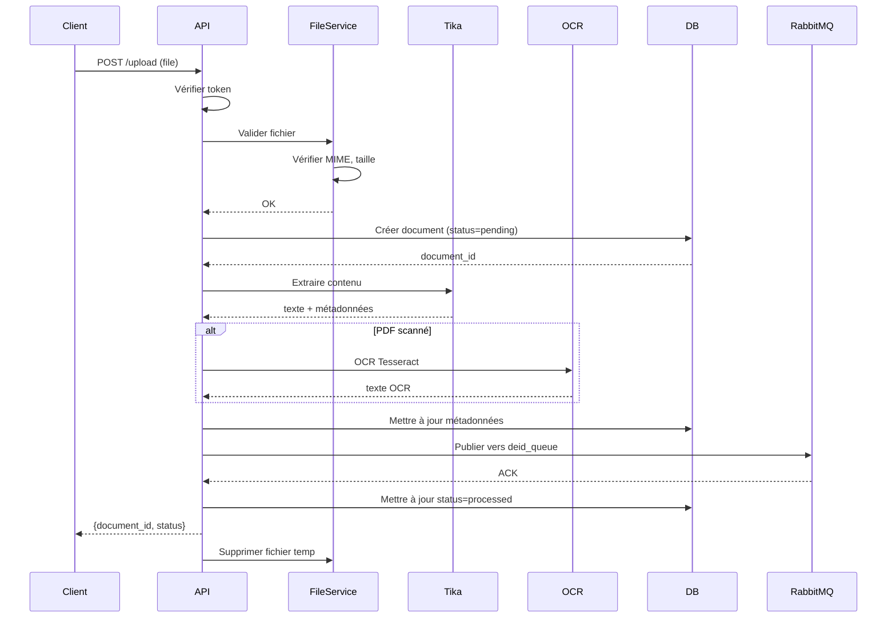

# 📄 DocIngestor - Service d'Ingestion de Documents Médicaux

**Version:** 1.0.0  
**Microservice du projet:** DocQA-MS (Assistant Médical Intelligent)

## 🎯 Objectif

DocIngestor est le point d'entrée principal du pipeline DocQA-MS. Il permet l'ingestion sécurisée, l'extraction et le routage des documents médicaux vers les services de traitement (désidentification, indexation, analyse).

## 📋 Fonctionnalités

### ✅ Upload de Documents

- **Formats supportés:** PDF, DOCX, TXT, XML, HL7
- **Validation:** Type MIME, taille maximale (50MB par défaut)
- **Sécurité:** Authentification par token Bearer
- **Stockage temporaire:** Fichiers nettoyés automatiquement après traitement

### 🔍 Extraction de Contenu

- **Apache Tika:** Extraction texte et métadonnées (auteur, date, pages)
- **OCR Tesseract:** Détection automatique des PDF scannés
- **Nettoyage:** Suppression caractères inutiles, normalisation

### 💾 Persistance

- **PostgreSQL:** Stockage des métadonnées (document_id, statut, métadonnées)
- **Table:** `documents` avec UUID, timestamps, JSONB metadata

### 🐰 Communication Asynchrone

- **RabbitMQ:** Publication vers `deid_queue` (désidentification)
- **Error Handling:** Messages d'erreur vers `error_queue`
- **Reconnexion automatique:** Retry logic intégré

### 📊 API REST

- **FastAPI:** Documentation Swagger auto-générée (`/docs`)
- **Endpoints:**
  - `POST /upload` - Upload de document
  - `GET /documents` - Liste paginée des documents
  - `GET /documents/{id}` - Détails d'un document
  - `GET /health` - Health check

### 🔒 Sécurité

- **Authentication:** Bearer token requis sur tous les endpoints (sauf /health)
- **CORS:** Configurable via environment
- **Validation:** Pydantic pour tous les inputs
- **Logging:** Audit trail complet au format JSON

## 🏗️ Architecture

```
backend/doc_ingestor/
│
├── main.py                 # Point d'entrée FastAPI
├── config.py              # Configuration centralisée
├── Dockerfile             # Image Docker multistage
├── requirements.txt       # Dépendances Python
├── README.md              # Cette documentation
│
├── routes/
│   ├── __init__.py
│   └── upload_routes.py   # Routes API (upload, list, get)
│
├── services/
│   ├── __init__.py
│   ├── file_service.py    # Gestion fichiers (validation, sauvegarde)
│   ├── tika_service.py    # Extraction avec Apache Tika
│   ├── ocr_service.py     # OCR avec Tesseract
│   ├── rabbitmq_service.py # Publication RabbitMQ
│   └── db_service.py      # CRUD PostgreSQL
│
├── models/
│   ├── __init__.py
│   └── document_model.py  # Modèle SQLAlchemy
│
└── utils/
    ├── __init__.py
    └── logger.py          # Logger JSON structuré
```

## 🚀 Démarrage Rapide

### Prérequis

- Docker & Docker Compose
- PostgreSQL (via docker-compose)
- RabbitMQ (via docker-compose)

### 1. Configuration

Créer un fichier `.env` dans `infra/` :

```bash
# PostgreSQL
POSTGRES_USER=docqa
POSTGRES_PASSWORD=docqa_pwd
POSTGRES_DB=docqa_db
POSTGRES_HOST=postgres
POSTGRES_PORT=5432

# RabbitMQ
RABBITMQ_DEFAULT_USER=admin
RABBITMQ_DEFAULT_PASS=admin

# DocIngestor
DOC_INGESTOR_TOKEN=supersecrettoken
MAX_FILE_SIZE_MB=50
```

### 2. Build et Run

```bash
# Depuis la racine du projet
cd infra/

# Build l'image
docker-compose build doc_ingestor

# Démarrer tous les services
docker-compose up -d

# Vérifier les logs
docker-compose logs -f doc_ingestor
```

### 3. Vérification

```bash
# Health check
curl http://localhost:8001/health

# Réponse attendue:
# {
#   "status": "ok",
#   "service": "doc_ingestor",
#   "version": "1.0.0"
# }
```

## 📡 API Endpoints

### 🔐 Authentification

Toutes les routes (sauf `/health`) nécessitent un token Bearer :

```bash
Authorization: Bearer supersecrettoken
```

### 📤 POST /upload

Upload un document médical.

**Request:**

```bash
curl -X POST "http://localhost:8001/upload" \
  -H "Authorization: Bearer supersecrettoken" \
  -F "file=@/path/to/rapport_medical.pdf"
```

**Response (200 OK):**

```json
{
  "document_id": "c4a2e812-b2f7-4a0a-a96b-12a7b7df0934",
  "status": "sent_to_queue",
  "message": "Document rapport_medical.pdf traité et envoyé vers deid_queue"
}
```

**Codes d'erreur:**

- `400 Bad Request` - Extension non autorisée ou fichier invalide
- `401 Unauthorized` - Token manquant ou invalide
- `413 Payload Too Large` - Fichier trop gros (> 50MB)
- `500 Internal Server Error` - Erreur de traitement

### 📋 GET /documents

Liste paginée des documents ingérés.

**Request:**

```bash
curl -X GET "http://localhost:8001/documents?page=1&page_size=20&status=processed" \
  -H "Authorization: Bearer supersecrettoken"
```

**Query Parameters:**

- `page` (int, default: 1) - Numéro de page
- `page_size` (int, default: 20, max: 100) - Documents par page
- `status` (string, optional) - Filtrer par statut (pending, processed, error)

**Response:**

```json
{
  "total": 42,
  "page": 1,
  "page_size": 20,
  "documents": [
    {
      "document_id": "c4a2e812-b2f7-4a0a-a96b-12a7b7df0934",
      "file_name": "rapport_medical.pdf",
      "type": "pdf",
      "upload_date": "2025-11-04T15:22:10.123456",
      "status": "processed",
      "file_size": 1234567,
      "metadata": {
        "author": "Dr. Martin",
        "pages": 3,
        "creation_date": "2025-11-03"
      },
      "content_preview": "Compte rendu de consultation...",
      "error_message": null
    }
  ]
}
```

### 📄 GET /documents/{document_id}

Récupère les détails d'un document spécifique.

**Request:**

```bash
curl -X GET "http://localhost:8001/documents/c4a2e812-b2f7-4a0a-a96b-12a7b7df0934" \
  -H "Authorization: Bearer supersecrettoken"
```

**Response:** Même structure qu'un élément de la liste.

### 💚 GET /health

Health check (pas d'authentification requise).

**Request:**

```bash
curl http://localhost:8001/health
```

**Response:**

```json
{
  "status": "ok",
  "service": "doc_ingestor",
  "version": "1.0.0"
}
```

## 🗄️ Modèle de Données

### Table `documents`

| Colonne           | Type         | Description                        |
| ----------------- | ------------ | ---------------------------------- |
| `document_id`     | UUID         | Identifiant unique (PK)            |
| `file_name`       | VARCHAR(255) | Nom du fichier original            |
| `type`            | VARCHAR(50)  | Type de document (pdf, docx, etc.) |
| `upload_date`     | TIMESTAMP    | Date d'upload                      |
| `status`          | VARCHAR(50)  | Statut (pending, processed, error) |
| `file_size`       | INTEGER      | Taille en bytes                    |
| `metadata`        | JSONB        | Métadonnées extraites              |
| `content_preview` | TEXT         | Aperçu du contenu (500 chars)      |
| `error_message`   | TEXT         | Message d'erreur si échec          |
| `created_at`      | TIMESTAMP    | Date de création                   |
| `updated_at`      | TIMESTAMP    | Date de mise à jour                |

### Exemple de `metadata` (JSONB)

```json
{
  "author": "Dr. Martin",
  "title": "Compte rendu de consultation",
  "creation_date": "2025-11-03",
  "pages": 3,
  "content_type": "application/pdf",
  "ocr_applied": false
}
```

## 🔄 Workflow de Traitement



## 🧰 Technologies Utilisées

### Backend

- **FastAPI 0.109.0** - Framework web moderne
- **Python 3.11** - Langage de programmation
- **Uvicorn** - Serveur ASGI
- **Pydantic** - Validation de données

### Extraction

- **Apache Tika 2.6.0** - Extraction texte/métadonnées
- **Tesseract OCR** - OCR pour PDF scannés
- **pdf2image** - Conversion PDF → images
- **Pillow** - Manipulation d'images

### Base de données

- **SQLAlchemy 2.0.25** - ORM Python
- **psycopg2-binary** - Driver PostgreSQL
- **PostgreSQL 15** - Base de données

### Messaging

- **Pika 1.3.2** - Client RabbitMQ Python
- **RabbitMQ 3.12** - Message broker

### Autres

- **python-multipart** - Upload de fichiers
- **python-dotenv** - Variables d'environnement
- **python-json-logger** - Logs JSON structurés

## 🔧 Variables d'Environnement

| Variable            | Description              | Défaut               |
| ------------------- | ------------------------ | -------------------- |
| `SERVICE_NAME`      | Nom du service           | `doc_ingestor`       |
| `API_PORT`          | Port d'écoute            | `8001`               |
| `API_TOKEN`         | Token d'authentification | `supersecrettoken`   |
| `MAX_FILE_SIZE_MB`  | Taille max fichier (MB)  | `50`                 |
| `TEMP_FOLDER`       | Dossier temporaire       | `/app/tmp`           |
| `POSTGRES_HOST`     | Hôte PostgreSQL          | `postgres`           |
| `POSTGRES_PORT`     | Port PostgreSQL          | `5432`               |
| `POSTGRES_DB`       | Nom de la DB             | `docqa_db`           |
| `POSTGRES_USER`     | Utilisateur DB           | `docqa`              |
| `POSTGRES_PASSWORD` | Mot de passe DB          | `docqa_pwd`          |
| `RABBITMQ_HOST`     | Hôte RabbitMQ            | `rabbitmq`           |
| `RABBITMQ_PORT`     | Port RabbitMQ            | `5672`               |
| `RABBITMQ_USER`     | Utilisateur RabbitMQ     | `admin`              |
| `RABBITMQ_PASSWORD` | Mot de passe RabbitMQ    | `admin`              |
| `DEID_QUEUE`        | Queue désidentification  | `deid_queue`         |
| `ERROR_QUEUE`       | Queue erreurs            | `error_queue`        |
| `TESSERACT_CMD`     | Chemin Tesseract         | `/usr/bin/tesseract` |
| `OCR_LANG`          | Langues OCR              | `fra+eng`            |

## 🧪 Tests Manuels

### Test 1: Upload PDF

```bash
# Créer un fichier de test
echo "Ceci est un rapport médical de test." > test.txt

# Convertir en PDF (ou utiliser un vrai PDF)
# Upload
curl -X POST "http://localhost:8001/upload" \
  -H "Authorization: Bearer supersecrettoken" \
  -F "file=@test.txt"

# Vérifier la réponse
# {"document_id": "...", "status": "sent_to_queue"}
```

### Test 2: Vérifier PostgreSQL

```bash
# Se connecter à PostgreSQL
docker exec -it docqa_postgres psql -U docqa -d docqa_db

# Lister les documents
SELECT document_id, file_name, status FROM documents;

# Quitter
\q
```

### Test 3: Vérifier RabbitMQ

1. Accéder à l'interface: http://localhost:15672
2. Login: `admin` / `admin`
3. Aller dans **Queues**
4. Vérifier que `deid_queue` contient 1 message

### Test 4: Liste des documents

```bash
curl -X GET "http://localhost:8001/documents?page=1&page_size=10" \
  -H "Authorization: Bearer supersecrettoken"
```

### Test 5: Swagger UI

1. Accéder à: http://localhost:8001/docs
2. Cliquer sur **Authorize** ⭐
3. Entrer: `supersecrettoken`
4. Tester les endpoints directement

## 📊 Logs et Monitoring

### Format des Logs

Tous les logs sont au format JSON :

```json
{
  "timestamp": "2025-11-04T15:22:10.123456",
  "level": "INFO",
  "service": "doc_ingestor",
  "message": "Action: upload_complete - Document: abc-123 - Status: sent_to_queue",
  "module": "upload_routes",
  "function": "upload_document",
  "line": 142,
  "document_id": "abc-123",
  "action": "upload_complete",
  "status": "sent_to_queue"
}
```

### Consulter les Logs

```bash
# Temps réel
docker-compose logs -f doc_ingestor

# Dernières 100 lignes
docker-compose logs --tail=100 doc_ingestor

# Filtrer par niveau
docker-compose logs doc_ingestor | grep ERROR
```

## ⚠️ Troubleshooting

### Problème: "Token invalide"

**Cause:** Token Bearer incorrect ou manquant

**Solution:**

```bash
# Vérifier le token dans .env
cat infra/.env | grep DOC_INGESTOR_TOKEN

# Utiliser le bon format:
curl -H "Authorization: Bearer supersecrettoken" ...
```

### Problème: "Fichier trop gros"

**Cause:** Fichier > 50MB

**Solution:**

```bash
# Augmenter la limite dans .env
MAX_FILE_SIZE_MB=100

# Rebuild le service
docker-compose up -d --build doc_ingestor
```

### Problème: "Erreur RabbitMQ"

**Cause:** RabbitMQ non démarré ou inaccessible

**Solution:**

```bash
# Vérifier que RabbitMQ est up
docker-compose ps rabbitmq

# Redémarrer RabbitMQ
docker-compose restart rabbitmq

# Attendre 10s puis redémarrer doc_ingestor
docker-compose restart doc_ingestor
```

### Problème: "Table documents inexistante"

**Cause:** Base de données non initialisée

**Solution:**

```bash
# Les tables sont créées automatiquement au démarrage
# Vérifier les logs:
docker-compose logs doc_ingestor | grep "db_init"

# Si erreur, recréer la DB:
docker-compose down -v
docker-compose up -d
```

## 🛠️ Développement Local

### Sans Docker

```bash
cd backend/doc_ingestor

# Installer les dépendances
pip install -r requirements.txt

# Installer Tesseract (Ubuntu/Debian)
sudo apt-get install tesseract-ocr tesseract-ocr-fra

# Variables d'environnement
export POSTGRES_HOST=localhost
export POSTGRES_PORT=5433
export RABBITMQ_HOST=localhost
export API_TOKEN=supersecrettoken

# Lancer le serveur
python main.py

# Ou avec uvicorn
uvicorn main:app --reload --port 8001
```

### Tests Unitaires

(À implémenter dans Sprint 3)

```bash
pytest tests/ -v
```

## 📖 Références

- [FastAPI Documentation](https://fastapi.tiangolo.com/)
- [Apache Tika](https://tika.apache.org/)
- [Tesseract OCR](https://github.com/tesseract-ocr/tesseract)
- [RabbitMQ Tutorials](https://www.rabbitmq.com/getstarted.html)
- [SQLAlchemy](https://docs.sqlalchemy.org/)

## 👥 Équipe & Support

**Projet:** DocQA-MS - Sprint 2  
**Service:** DocIngestor  
**Contact:** Équipe DocQA

## 📝 Changelog

### Version 1.0.0 (Sprint 2)

- ✅ Upload de documents (PDF, DOCX, TXT, XML, HL7)
- ✅ Extraction avec Apache Tika
- ✅ OCR Tesseract pour PDF scannés
- ✅ Stockage PostgreSQL
- ✅ Publication RabbitMQ
- ✅ API REST avec authentification
- ✅ Logs JSON structurés
- ✅ Documentation Swagger

---

**🎉 DocIngestor est prêt pour la production !**
