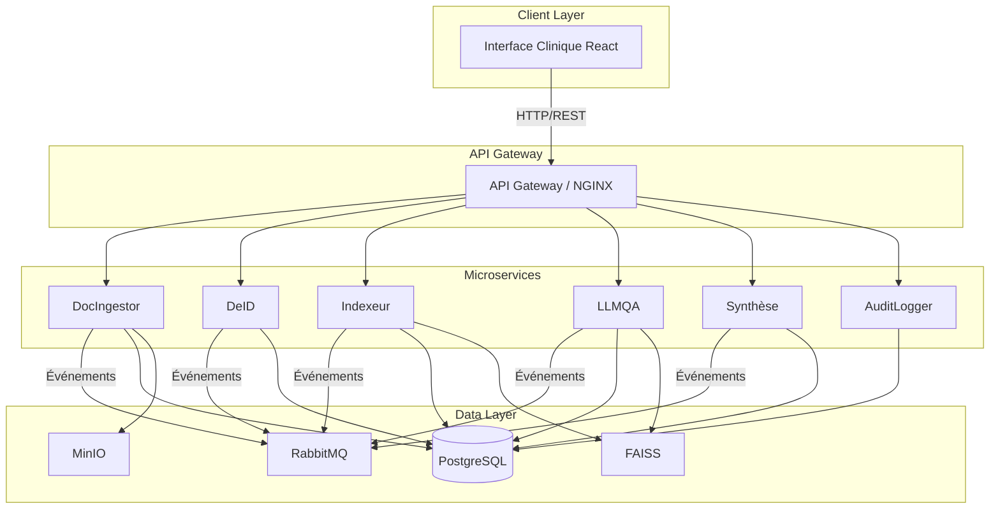
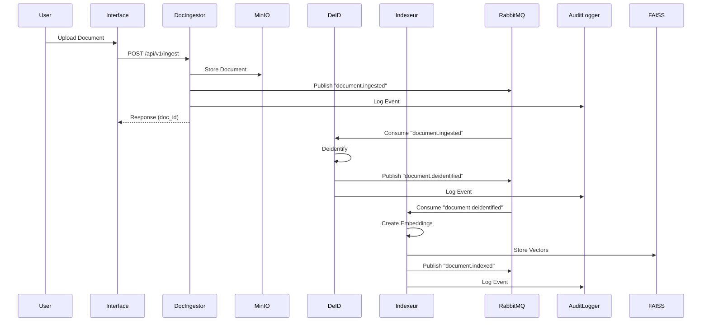
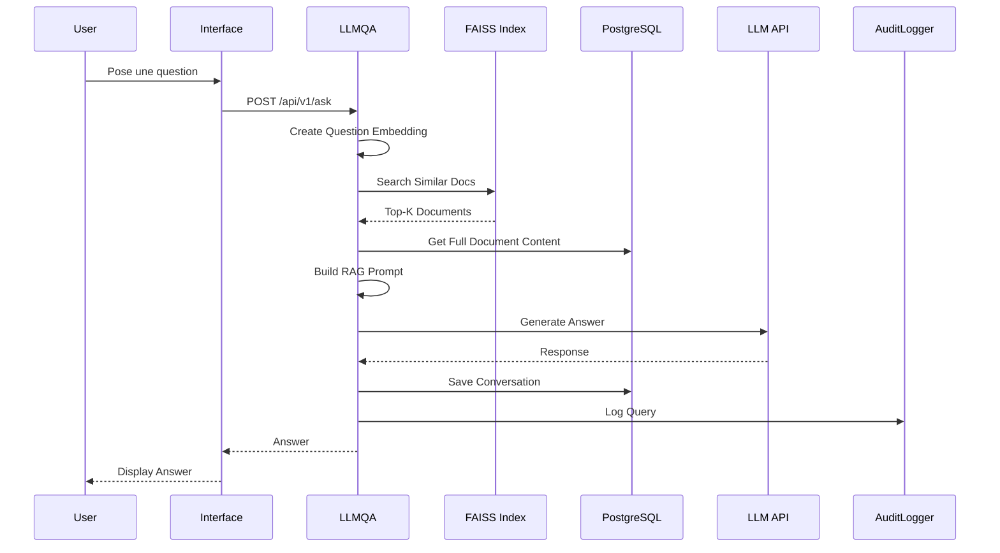
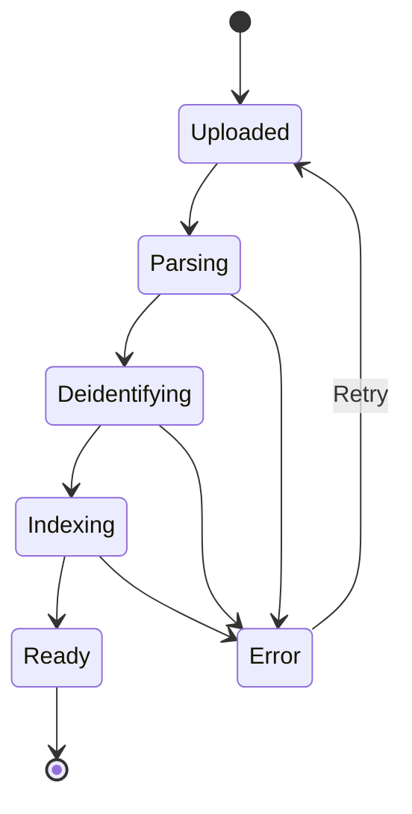
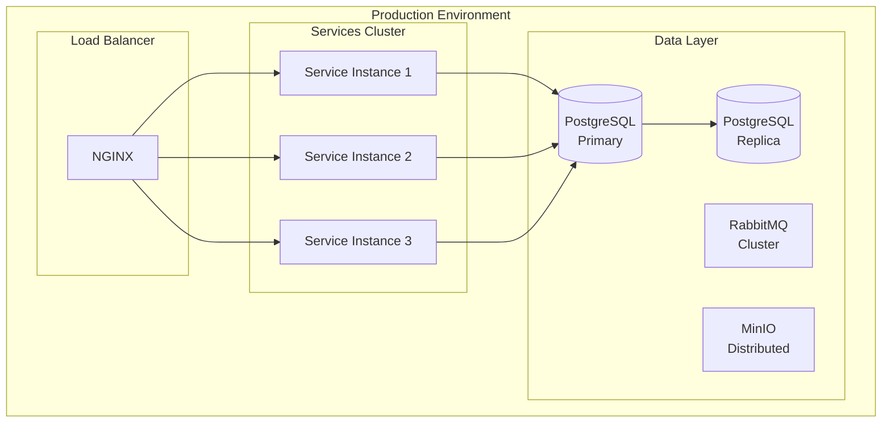

# 🏗️ Architecture DocQA-MS

## Vue d'ensemble

DocQA-MS est une plateforme d'analyse de documents médicaux basée sur une architecture microservices moderne, intégrant des technologies LLM (Large Language Models) et RAG (Retrieval Augmented Generation).

## Table des matières

1. [Principes Architecturaux](#principes-architecturaux)
2. [Architecture Microservices](#architecture-microservices)
3. [Flux de Données](#flux-de-données)
4. [Infrastructure](#infrastructure)
5. [Sécurité](#sécurité)
6. [Scalabilité](#scalabilité)
7. [Monitoring](#monitoring)

---

## Principes Architecturaux

### 🎯 Objectifs

- **Modularité** : Chaque service a une responsabilité unique et bien définie
- **Scalabilité** : Chaque microservice peut être scalé indépendamment
- **Résilience** : Isolation des pannes, retry automatique, circuit breakers
- **Traçabilité** : Logging centralisé et audit de toutes les opérations
- **Sécurité** : Désidentification automatique, chiffrement, authentification

### 📐 Patterns Utilisés

- **Microservices Architecture** : Séparation en services indépendants
- **Event-Driven Architecture** : Communication asynchrone via RabbitMQ
- **Repository Pattern** : Abstraction de la couche de données
- **Service Layer Pattern** : Logique métier centralisée
- **API Gateway Pattern** : Point d'entrée unique pour le frontend
- **CQRS** : Séparation lecture/écriture pour certaines opérations

---

## Architecture Microservices

### 🔄 Schéma Détaillé



### 🧩 Description des Services

#### 1. DocIngestor (Port 8001)

**Responsabilité** : Ingestion et parsing de documents médicaux

**Fonctionnalités** :

- Upload de fichiers (PDF, DOCX, TXT, HL7, XML)
- Extraction de texte et métadonnées
- Validation et nettoyage du contenu
- Stockage dans MinIO
- Émission d'événements pour les services suivants

**Technologies** :

- FastAPI
- PyPDF2 (PDF)
- python-docx (DOCX)
- hl7apy (HL7)
- MinIO SDK

**Endpoints** :

```
POST /api/v1/ingest        - Upload un document
GET  /api/v1/documents     - Liste les documents
GET  /api/v1/documents/:id - Récupère un document
```

**Événements émis** :

- `document.ingested` → Vers DeID

---

#### 2. DeID (Port 8002)

**Responsabilité** : Désidentification des données sensibles

**Fonctionnalités** :

- Détection d'entités nommées (NER)
- Suppression/masquage des informations personnelles (noms, dates, adresses)
- Pseudonymisation
- Respect du RGPD
- Journalisation des opérations

**Technologies** :

- FastAPI
- spaCy / Transformers (NER)
- Regex patterns pour données médicales
- PostgreSQL (mapping pseudonymes)

**Endpoints** :

```
POST /api/v1/deidentify      - Désidentifie un texte
GET  /api/v1/deidentified    - Liste les documents désidentifiés
```

**Événements** :

- Écoute : `document.ingested`
- Émet : `document.deidentified` → Vers Indexeur

---

#### 3. Indexeur Sémantique (Port 8003)

**Responsabilité** : Création d'embeddings et indexation vectorielle

**Fonctionnalités** :

- Génération d'embeddings avec Sentence-Transformers
- Chunking intelligent du texte
- Indexation FAISS
- Recherche sémantique
- Mise à jour incrémentale de l'index

**Technologies** :

- FastAPI
- Sentence-Transformers
- FAISS (Facebook AI Similarity Search)
- NumPy

**Endpoints** :

```
POST /api/v1/index           - Indexe un document
POST /api/v1/search          - Recherche sémantique
GET  /api/v1/similar/:id     - Documents similaires
```

**Événements** :

- Écoute : `document.deidentified`
- Émet : `document.indexed`

---

#### 4. LLMQA Module (Port 8004)

**Responsabilité** : Question-Réponse avec RAG (Retrieval Augmented Generation)

**Fonctionnalités** :

- Réception de questions en langage naturel
- Recherche de contexte pertinent via FAISS
- Génération de réponses avec LLM
- Streaming de réponses
- Gestion du contexte conversationnel

**Technologies** :

- FastAPI
- LangChain
- OpenAI API / Hugging Face Transformers
- FAISS pour retrieval
- Redis (cache optionnel)

**Endpoints** :

```
POST /api/v1/ask              - Pose une question
POST /api/v1/ask/stream       - Question avec streaming
GET  /api/v1/conversations    - Historique des conversations
```

**Architecture RAG** :

```
Question → Embedding → FAISS Search → Top-K Docs → LLM Prompt → Réponse
```

---

#### 5. Synthèse Comparative (Port 8005)

**Responsabilité** : Résumés et comparaisons de documents

**Fonctionnalités** :

- Résumé automatique de documents
- Comparaison de plusieurs documents
- Extraction d'informations clés
- Génération de rapports

**Technologies** :

- FastAPI
- LangChain
- LLM (GPT, Claude, etc.)

**Endpoints** :

```
POST /api/v1/summarize        - Résume un document
POST /api/v1/compare          - Compare plusieurs documents
GET  /api/v1/summaries        - Liste des résumés
```

---

#### 6. AuditLogger (Port 8006)

**Responsabilité** : Traçabilité et logs centralisés

**Fonctionnalités** :

- Journalisation de toutes les opérations
- Audit des accès aux documents
- Métriques et statistiques
- Alertes en cas d'anomalies
- Export des logs

**Technologies** :

- FastAPI
- PostgreSQL (logs structurés)
- ELK Stack (optionnel en prod)

**Endpoints** :

```
POST /api/v1/log              - Enregistre un événement
GET  /api/v1/logs             - Recherche dans les logs
GET  /api/v1/audit/:id        - Audit d'un document
GET  /api/v1/metrics          - Métriques du système
```

---

#### 7. Interface Clinique (Port 3000)

**Responsabilité** : Interface utilisateur web

**Fonctionnalités** :

- Upload de documents
- Chat avec les documents
- Visualisation des résultats
- Gestion des utilisateurs
- Dashboard de monitoring

**Technologies** :

- React 18
- TailwindCSS
- Axios
- React Router
- Zustand / Redux (état global)

---

## Flux de Données

### 📊 Flux d'Ingestion



### 💬 Flux de Question-Réponse



---

## Infrastructure

### 🗄️ Base de Données (PostgreSQL)

**Schéma Principal** :

```sql
-- Documents
CREATE TABLE documents (
    id SERIAL PRIMARY KEY,
    filename VARCHAR(255) NOT NULL,
    file_type VARCHAR(50),
    file_size BIGINT,
    upload_date TIMESTAMP DEFAULT NOW(),
    status VARCHAR(50),
    minio_path TEXT,
    metadata JSONB,
    is_active BOOLEAN DEFAULT TRUE,
    created_at TIMESTAMP DEFAULT NOW(),
    updated_at TIMESTAMP DEFAULT NOW()
);

-- Documents désidentifiés
CREATE TABLE deidentified_documents (
    id SERIAL PRIMARY KEY,
    original_document_id INTEGER REFERENCES documents(id),
    deidentified_text TEXT,
    entities_removed JSONB,
    pseudonym_mapping JSONB,
    created_at TIMESTAMP DEFAULT NOW()
);

-- Index FAISS metadata
CREATE TABLE faiss_metadata (
    id SERIAL PRIMARY KEY,
    document_id INTEGER REFERENCES documents(id),
    chunk_id INTEGER,
    chunk_text TEXT,
    embedding_model VARCHAR(100),
    created_at TIMESTAMP DEFAULT NOW()
);

-- Conversations
CREATE TABLE conversations (
    id SERIAL PRIMARY KEY,
    user_id INTEGER,
    question TEXT,
    answer TEXT,
    context_docs JSONB,
    model_used VARCHAR(100),
    created_at TIMESTAMP DEFAULT NOW()
);

-- Audit Logs
CREATE TABLE audit_logs (
    id SERIAL PRIMARY KEY,
    service_name VARCHAR(50),
    action VARCHAR(100),
    entity_type VARCHAR(50),
    entity_id INTEGER,
    user_id INTEGER,
    metadata JSONB,
    ip_address VARCHAR(45),
    created_at TIMESTAMP DEFAULT NOW()
);
```

### 📨 RabbitMQ - Queues & Exchanges

**Exchanges** :

- `docqa.events` (type: topic)

**Queues** :

- `docqa.ingest` → DocIngestor
- `docqa.deid` → DeID
- `docqa.index` → Indexeur
- `docqa.llmqa` → LLMQA
- `docqa.synthese` → Synthèse
- `docqa.audit` → AuditLogger

**Routing Keys** :

- `document.ingested`
- `document.deidentified`
- `document.indexed`
- `question.asked`
- `summary.generated`

### 🗂️ MinIO - Buckets

- `docqa-documents` : Documents originaux
- `docqa-processed` : Documents traités
- `docqa-exports` : Exports et rapports

---

## Sécurité

### 🔐 Mesures de Sécurité

1. **Authentification**

   - JWT tokens pour API
   - OAuth2 pour utilisateurs
   - API Keys pour services externes

2. **Désidentification**

   - Automatique sur tous les documents
   - Pseudonymisation réversible
   - Logs des opérations

3. **Chiffrement**

   - TLS/SSL pour toutes les communications
   - Chiffrement au repos (MinIO)
   - Variables d'environnement sécurisées

4. **Isolation**

   - Network isolation avec Docker
   - Principe du moindre privilège
   - Conteneurs non-root

5. **Audit**
   - Logs de toutes les opérations
   - Traçabilité complète
   - Alertes en cas d'anomalies

---

## Scalabilité

### 📈 Stratégies de Scalabilité

1. **Scalabilité Horizontale**

   - Chaque microservice peut être répliqué
   - Load balancing avec NGINX
   - Auto-scaling avec Kubernetes (futur)

2. **Cache**

   - Redis pour les résultats fréquents
   - Cache d'embeddings
   - Cache de réponses LLM

3. **Optimisations**

   - Connection pooling (PostgreSQL)
   - Async I/O partout
   - Batching pour embeddings
   - Index FAISS optimisés

4. **Queuing**
   - RabbitMQ pour traitement asynchrone
   - Retry avec backoff exponentiel
   - Dead letter queues

---

## Monitoring

### 📊 Métriques Clés

1. **Performance**

   - Temps de réponse par service
   - Throughput (requêtes/sec)
   - Latence FAISS
   - Temps de génération LLM

2. **Disponibilité**

   - Uptime des services
   - Health checks
   - Taux d'erreur

3. **Ressources**

   - CPU / RAM par service
   - Espace disque
   - Connexions DB

4. **Business**
   - Nombre de documents ingérés
   - Nombre de questions posées
   - Taux de satisfaction

### 🔧 Outils

- **Logging** : ELK Stack (Elasticsearch, Logstash, Kibana)
- **Metrics** : Prometheus + Grafana
- **Tracing** : Jaeger
- **Alerting** : AlertManager

---

## Diagrammes Complémentaires

### 🔄 États d'un Document



### 📦 Déploiement



---

## Évolutions Futures

### 🚀 Roadmap Technique

1. **Phase 2** (Court terme)

   - Ajout de métriques Prometheus
   - Dashboard Grafana
   - Tests de charge

2. **Phase 3** (Moyen terme)

   - Migration vers Kubernetes
   - Auto-scaling
   - Multi-régions

3. **Phase 4** (Long terme)
   - Support multi-langue
   - Modèles LLM on-premise
   - IA pour diagnostic automatique

---

## Conclusion

L'architecture de DocQA-MS est conçue pour être :

- **Modulaire** : Ajout facile de nouveaux services
- **Scalable** : Prête pour la croissance
- **Résiliente** : Tolérance aux pannes
- **Sécurisée** : Protection des données médicales
- **Observable** : Monitoring complet

Cette architecture permet de répondre aux exigences d'un système médical moderne tout en restant flexible pour les évolutions futures.
