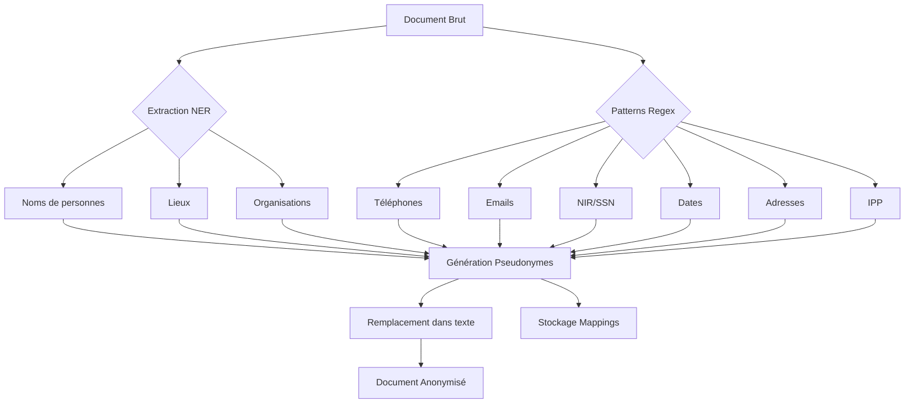

# 🔒 Deid-Service

<div align="center">


**🏥 Service d'Anonymisation des Documents Médicaux**

*Protection des données personnelles • Conformité RGPD • NER Médical*

[Architecture](#-architecture) •
[Fonctionnalités](#-fonctionnalités) •
[API](#-api-endpoints) •
[Installation](#-installation)

</div>

---

## 🎯 Présentation

**Deid-Service** (De-Identification Service) est le gardien de la confidentialité dans DocQA. Il anonymise automatiquement toutes les données personnelles sensibles des documents médicaux tout en préservant l'utilité clinique du contenu.

```
📄 Document Brut → 🔍 Détection NER → 🔐 Anonymisation → 📤 Document Sécurisé
```

---

## 🏗️ Architecture

```
┌───────────────────────────────────────────────────────────────────┐
│                        DEID-SERVICE                                │
├───────────────────────────────────────────────────────────────────┤
│                                                                    │
│   ┌─────────────┐         ┌──────────────────────────────┐        │
│   │  RabbitMQ   │────────►│     Document Consumer        │        │
│   │  Listener   │         │  (documents.raw → .anonymized)│        │
│   └─────────────┘         └──────────────┬───────────────┘        │
│                                          │                         │
│                           ┌──────────────▼───────────────┐        │
│                           │       DEID SERVICE           │        │
│                           ├──────────────────────────────┤        │
│                           │  ┌────────────────────────┐  │        │
│                           │  │   Medical NER Engine   │  │        │
│                           │  │  (Noms, Lieux, Orgs)   │  │        │
│                           │  └────────────────────────┘  │        │
│                           │  ┌────────────────────────┐  │        │
│                           │  │    Regex Patterns      │  │        │
│                           │  │  (Tel, Email, SSN...)  │  │        │
│                           │  └────────────────────────┘  │        │
│                           │  ┌────────────────────────┐  │        │
│                           │  │   Pseudonymization     │  │        │
│                           │  │     Generator          │  │        │
│                           │  └────────────────────────┘  │        │
│                           └──────────────┬───────────────┘        │
│                                          │                         │
│   ┌─────────────┐         ┌──────────────▼───────────────┐        │
│   │ PostgreSQL  │◄────────│      Mapping Repository      │        │
│   │  Mappings   │         │   (Original ↔ Pseudonyme)    │        │
│   └─────────────┘         └──────────────────────────────┘        │
│                                                                    │
└───────────────────────────────────────────────────────────────────┘
```

---

## ✨ Fonctionnalités

### 🔍 Détection Multi-Catégories

| Catégorie | Pattern | Exemple | Pseudonyme |
|-----------|---------|---------|------------|
| 👤 **Noms** | NER ML | `Dr. Martin Dupont` | `[PERSON_A1B2C3]` |
| 📞 **Téléphones** | Regex FR | `06 12 34 56 78` | `[PHONE_X1Y2Z3]` |
| 📧 **Emails** | Regex | `patient@email.fr` | `[EMAIL_D4E5F6]` |
| 🆔 **NIR/SSN** | Regex FR | `1 85 12 75 108 123 45` | `[SSN_G7H8I9]` |
| 📅 **Dates** | Regex | `15/03/1985` | `[DATE_ANONYMISÉE]` |
| 🏠 **Adresses** | Regex + NER | `12 rue de Paris` | `[ADDRESS_J0K1L2]` |
| 🏥 **IPP** | Regex | `IPP: 123456789` | `[IPP_M3N4O5]` |

### 🧠 NER Médical (Named Entity Recognition)

```
Document Original:
"Le patient Jean-Pierre MARTIN, né le 15/03/1965, 
consulte pour douleurs thoraciques. 
Contact: 06 12 34 56 78"

                    ▼ DEID-SERVICE ▼

Document Anonymisé:
"Le patient [PERSON_8A0FD748], né le [DATE_ANONYMISÉE], 
consulte pour douleurs thoraciques. 
Contact: [PHONE_3B2C1D0E]"
```

### 🔄 Pipeline de Traitement



---

## 🛠️ API Endpoints

### `POST /api/deid/anonymize`

Anonymise un document.

```bash
curl -X POST "http://localhost:8002/api/deid/anonymize" \
  -H "Content-Type: application/json" \
  -d '{
    "documentId": "DOC123",
    "documentContent": "Patient: Jean Dupont, né le 12/05/1980..."
  }'
```

**Response:**
```json
{
  "documentId": "DOC123",
  "anonymizedContent": "Patient: [PERSON_A1B2C3], né le [DATE_ANONYMISÉE]...",
  "entitiesFound": 5,
  "processingTimeMs": 234
}
```

### `GET /api/deid/mappings/{documentId}`

Récupère les mappings d'un document.

```json
{
  "documentId": "DOC123",
  "mappings": [
    {
      "original": "Jean Dupont",
      "pseudonym": "[PERSON_A1B2C3]",
      "entityType": "PERSON"
    },
    {
      "original": "12/05/1980",
      "pseudonym": "[DATE_ANONYMISÉE]",
      "entityType": "DATE"
    }
  ]
}
```

### `POST /api/deid/reidentify`

Ré-identifie un document (accès restreint).

```bash
curl -X POST "http://localhost:8002/api/deid/reidentify" \
  -H "Content-Type: application/json" \
  -d '{
    "documentId": "DOC123",
    "anonymizedContent": "Patient: [PERSON_A1B2C3]..."
  }'
```

### `GET /health`

```json
{
  "status": "UP",
  "components": {
    "db": "UP",
    "rabbitMQ": "UP",
    "nerModel": "LOADED"
  }
}
```

---

## ⚙️ Configuration

### `application.yml`

```yaml
server:
  port: 8002

spring:
  application:
    name: deid-service
    
  datasource:
    url: jdbc:postgresql://postgres:5432/docqa_deid
    username: docqa_user
    password: docqa_password
    
  rabbitmq:
    host: rabbitmq
    port: 5672
    username: docqa_user
    password: docqa_password

# Queues RabbitMQ
messaging:
  queue:
    input: documents.raw
    output: documents.anonymized

# Configuration NER
ner:
  model:
    path: /app/models/camembert-ner
    language: fr
```

---

## 📦 Installation

### 🐳 Docker (Recommandé)

```bash
# Depuis la racine du projet
docker-compose up -d deid-service
```

### 💻 Local (Maven)

```bash
# 1. Compiler
cd microservices/deid-service
mvn clean package -DskipTests

# 2. Lancer
java -jar target/deid-service-1.0.0.jar
```

---

## 📁 Structure du Projet

```
deid-service/
├── 📄 pom.xml                    # Configuration Maven
├── 🐳 Dockerfile                 # Image Docker
│
└── 📂 src/main/java/com/docqa/deid/
    │
    ├── 📄 DeidApplication.java   # Point d'entrée Spring Boot
    │
    ├── 📂 config/
    │   └── RabbitConfig.java     # Configuration RabbitMQ
    │
    ├── 📂 controller/
    │   └── DeidController.java   # Endpoints REST
    │
    ├── 📂 service/
    │   ├── DeidService.java      # Logique d'anonymisation
    │   └── MedicalNERService.java # Extraction NER
    │
    ├── 📂 messaging/
    │   └── DocumentConsumer.java # Consumer RabbitMQ
    │
    ├── 📂 model/
    │   ├── DeidRequest.java      # DTO requête
    │   └── DeidMapping.java      # Entity mapping
    │
    ├── 📂 repository/
    │   └── DeidMappingRepository.java
    │
    └── 📂 exception/
        └── DeidException.java    # Exceptions custom
```

---

## 🔐 Sécurité & Conformité

### RGPD Compliance

| Exigence | Implémentation |
|----------|----------------|
| **Minimisation** | Seules les données nécessaires sont traitées |
| **Pseudonymisation** | Remplacement par identifiants non-réversibles |
| **Traçabilité** | Logs d'audit pour chaque opération |
| **Droit à l'oubli** | Suppression des mappings sur demande |

### Patterns Français

```java
// Numéro de Sécurité Sociale (NIR)
Pattern SSN = Pattern.compile(
    "\\b[12]\\s?\\d{2}\\s?\\d{2}\\s?\\d{2}\\s?\\d{3}\\s?\\d{3}\\s?\\d{2}\\b"
);

// Téléphone français
Pattern PHONE = Pattern.compile(
    "(?:(?:\\+33|0033|0)\\s?[1-9](?:[\\s.-]?\\d{2}){4})"
);
```

---

## 📊 Métriques

| Métrique | Description |
|----------|-------------|
| `documents_processed` | Documents traités |
| `entities_detected` | Entités détectées |
| `processing_time_avg` | Temps moyen de traitement |
| `ner_accuracy` | Précision du modèle NER |

---

## 🐛 Troubleshooting

### Modèle NER non chargé

```bash
# Vérifier que le modèle est présent
ls -la /app/models/

# Logs du service
docker-compose logs deid-service
```

### Performances lentes

```yaml
# Augmenter les ressources dans docker-compose.yml
deploy:
  resources:
    limits:
      memory: 2G
```

---

## 🔗 Intégration Pipeline

```
┌─────────────┐     ┌─────────────┐     ┌──────────────────┐
│doc-ingestor │────►│ deid-service│────►│indexeur-semantique│
│             │     │             │     │                  │
│ documents   │     │ anonymized  │     │   indexed        │
│   .raw      │     │ documents   │     │   documents      │
└─────────────┘     └─────────────┘     └──────────────────┘
```

---

<div align="center">

**Fait avec ❤️ pour DocQA**

*Protéger la vie privée, préserver l'utilité clinique*

🔒 **RGPD Compliant** | 🇫🇷 **Optimisé France** | 🧠 **NER Intelligent**

</div>
