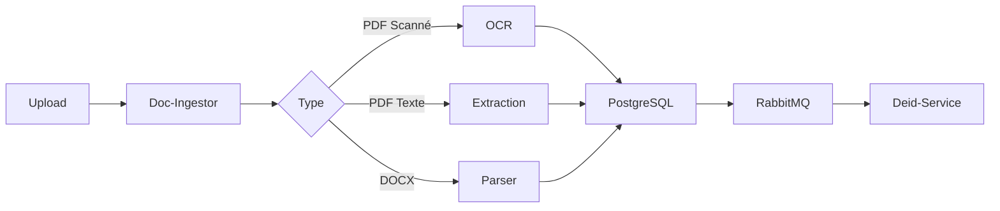

# 📄 Doc-Ingestor

<div align="center">


**🏥 Microservice d'Ingestion de Documents Médicaux**

*Extraction intelligente et OCR pour tous vos documents cliniques*

[Architecture](#-architecture) •
[Fonctionnalités](#-fonctionnalités) •
[API](#-api-endpoints) •
[Installation](#-installation)

</div>

---

## 🎯 Présentation

**Doc-Ingestor** est le point d'entrée du pipeline DocQA. Il gère l'upload, l'extraction de contenu et le stockage des documents médicaux (PDF, DOCX, TXT). C'est la première étape cruciale pour permettre l'analyse IA de vos dossiers patients.

```
📁 Document Upload → 🔍 Extraction → 💾 Stockage → 📨 Publication RabbitMQ
```

---

## 🏗️ Architecture

```
┌─────────────────────────────────────────────────────────────────┐
│                      DOC-INGESTOR                                │
├─────────────────────────────────────────────────────────────────┤
│                                                                  │
│    ┌──────────┐    ┌──────────────┐    ┌──────────────┐         │
│    │  FastAPI │───►│  Extractors  │───►│  PostgreSQL  │         │
│    │  Routes  │    │  PDF/DOCX    │    │  Documents   │         │
│    └────┬─────┘    └──────────────┘    └──────────────┘         │
│         │                                      │                 │
│         │          ┌──────────────┐            │                 │
│         └─────────►│   OCR/Tika   │            │                 │
│                    │   Engine     │            │                 │
│                    └──────────────┘            │                 │
│                                                │                 │
│    ┌──────────────────────────────────────────┴─────┐           │
│    │              RabbitMQ Publisher                 │           │
│    │         documents.raw → deid-service           │           │
│    └────────────────────────────────────────────────┘           │
│                                                                  │
└─────────────────────────────────────────────────────────────────┘
```

---

## ✨ Fonctionnalités

### 📤 Upload Multi-Format
| Format | Extension | Support OCR |
|--------|-----------|-------------|
| PDF    | `.pdf`    | ✅ Oui      |
| Word   | `.docx`   | ❌ Non      |
| Word Legacy | `.doc` | ❌ Non   |
| Texte  | `.txt`    | ❌ N/A      |

### 🔍 Extraction Intelligente

- **📝 Texte natif** : Extraction directe pour les PDF textuels
- **🖼️ OCR Tesseract** : Reconnaissance optique pour les scans
- **📊 Métadonnées** : Extraction automatique (auteur, date, pages)
- **🏷️ Classification** : Détection automatique du type de document

### 🔄 Intégration Pipeline



---

## 🛠️ API Endpoints

### `POST /api/documents/upload`
Upload d'un nouveau document médical.

```bash
curl -X POST "http://localhost:8001/api/documents/upload" \
  -H "Content-Type: multipart/form-data" \
  -F "file=@consultation.pdf" \
  -F "patient_id=P12345"
```

**Response:**
```json
{
  "id": 42,
  "filename": "consultation.pdf",
  "patient_id": "P12345",
  "content_type": "application/pdf",
  "status": "processing",
  "uploaded_at": "2025-12-05T10:30:00Z"
}
```

### `GET /api/documents`
Liste tous les documents avec pagination.

```bash
curl "http://localhost:8001/api/documents?page=1&limit=20"
```

### `GET /api/documents/{id}`
Récupère un document par ID.

### `DELETE /api/documents/{id}`
Supprime un document.

### `GET /health`
Health check du service.

```json
{
  "status": "healthy",
  "database": "connected",
  "rabbitmq": "connected",
  "version": "1.0.0"
}
```

---

## ⚙️ Configuration

### Variables d'Environnement

```env
# 🔧 Service Configuration
SERVICE_NAME=DocIngestor
SERVICE_PORT=8001
SERVICE_HOST=0.0.0.0
DEBUG=true

# 💾 Database (PostgreSQL)
DB_HOST=postgres
DB_PORT=5432
DB_NAME=docqa_ingestor
DB_USER=docqa_user
DB_PASSWORD=docqa_password

# 📨 RabbitMQ
RABBITMQ_HOST=rabbitmq
RABBITMQ_PORT=5672
RABBITMQ_USER=docqa_user
RABBITMQ_PASSWORD=docqa_password
RABBITMQ_QUEUE=documents.raw

# 📁 File Storage
UPLOAD_DIR=./data/documents
TEMP_DIR=./data/temp
MAX_FILE_SIZE=52428800  # 50MB

# 🔍 OCR Configuration
OCR_ENABLED=true
TESSERACT_CMD=/usr/bin/tesseract
```

---

## 📦 Installation

### 🐳 Docker (Recommandé)

```bash
# Depuis la racine du projet
docker-compose up -d doc-ingestor
```

### 💻 Local

```bash
# 1. Créer l'environnement virtuel
cd microservices/doc-ingestor
python -m venv venv
source venv/bin/activate  # Linux/Mac
.\venv\Scripts\activate   # Windows

# 2. Installer les dépendances
pip install -r requirements.txt

# 3. Configurer les variables d'environnement
cp .env.example .env
# Éditer .env avec vos paramètres

# 4. Lancer le service
python app.py
```

---

## 📁 Structure du Projet

```
doc-ingestor/
├── 📄 app.py                 # Point d'entrée FastAPI
├── ⚙️ config.py              # Configuration Pydantic
├── 📋 requirements.txt       # Dépendances Python
├── 🐳 Dockerfile            # Image Docker
│
├── 📂 src/
│   ├── 📂 api/
│   │   └── routes.py        # Endpoints REST
│   │
│   ├── 📂 database/
│   │   └── repository.py    # Accès PostgreSQL
│   │
│   ├── 📂 services/
│   │   ├── extractor.py     # Extraction de contenu
│   │   ├── ocr.py           # Service OCR
│   │   └── metadata.py      # Extraction métadonnées
│   │
│   └── 📂 messaging/
│       └── publisher.py     # Publication RabbitMQ
│
├── 📂 data/
│   ├── documents/           # Stockage des fichiers
│   └── temp/               # Fichiers temporaires
│
└── 📂 tests/
    └── test_api.py         # Tests unitaires
```

---

## 🔗 Dépendances

```txt
fastapi>=0.104.0      # Framework web
uvicorn>=0.24.0       # Serveur ASGI
python-multipart      # Upload de fichiers
pika>=1.3.0          # Client RabbitMQ
psycopg2-binary      # Driver PostgreSQL
PyPDF2>=3.0.0        # Extraction PDF
python-docx          # Extraction DOCX
pytesseract          # OCR Tesseract
Pillow               # Traitement d'images
pydantic-settings    # Configuration
```

---

## 📊 Métriques & Monitoring

| Métrique | Description | Endpoint |
|----------|-------------|----------|
| Documents traités | Compteur total | `/metrics` |
| Temps d'extraction | Moyenne par type | `/metrics` |
| Erreurs OCR | Taux d'échec | `/metrics` |
| Taille stockage | Espace utilisé | `/health` |

---

## 🐛 Troubleshooting

### OCR ne fonctionne pas
```bash
# Vérifier que Tesseract est installé
tesseract --version

# Linux: installer les langues FR
apt-get install tesseract-ocr-fra
```

### Erreur connexion PostgreSQL
```bash
# Vérifier que le container est up
docker-compose ps postgres

# Tester la connexion
psql -h localhost -p 5433 -U docqa_user -d docqa_ingestor
```

### RabbitMQ non disponible
```bash
# Vérifier le container
docker-compose logs rabbitmq

# Accéder à l'interface
# http://localhost:15672 (guest/guest)
```

---

## 📞 Support

| Ressource | Lien |
|-----------|------|
| 📚 Documentation | `/docs` (Swagger UI) |
| 🐛 Issues | GitHub Issues |
| 💬 Discussion | GitHub Discussions |

---

<div align="center">

**Fait avec ❤️ pour DocQA**

*Partie du pipeline d'analyse de documents médicaux*

</div>
